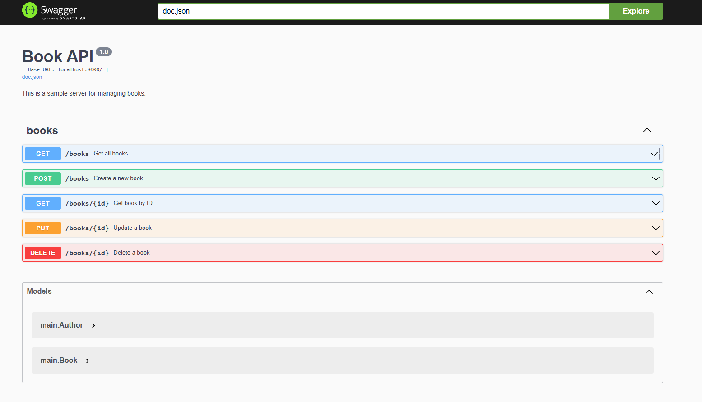

# Book CRUD API

RESTful API สำหรับจัดการข้อมูลหนังสือ (Book) ด้วยภาษา Go  
รองรับ Swagger UI สำหรับดูเอกสารและทดสอบ API



## Features

- สร้าง (Create) หนังสือ
- อ่าน (Read) รายการหนังสือและหนังสือรายเล่ม
- แก้ไข (Update) ข้อมูลหนังสือ
- ลบ (Delete) หนังสือ
- เอกสาร API ด้วย Swagger UI

## Getting Started

### Prerequisites

- Go 1.18+ (แนะนำให้ใช้เวอร์ชันล่าสุด)
- [swag](https://github.com/swaggo/swag) (สำหรับ generate Swagger docs)

### ติดตั้ง dependencies

```sh
go mod tidy
```

### Generate Swagger docs (ถ้าต้องการแก้ไขหรืออัปเดตเอกสาร)

```sh
go install github.com/swaggo/swag/cmd/swag@latest
swag init
```

### รันเซิร์ฟเวอร์

```sh
go run main.go
```

เซิร์ฟเวอร์จะรันที่ [http://localhost:8000](http://localhost:8000)

### เปิด Swagger UI

ไปที่ [http://localhost:8000/swagger/index.html](http://localhost:8000/swagger/index.html) เพื่อดูและทดสอบ API

---

## API Endpoints

### Get all books

```http
GET /books
```

### Get book by ID

```http
GET /books/{id}
```

### Create a new book

```http
POST /books
Content-Type: application/json

{
  "isbn": "1234567890",
  "title": "New Book",
  "author": {
    "first_name": "John",
    "last_name": "Doe"
  }
}
```

### Update a book

```http
PUT /books/{id}
Content-Type: application/json

{
  "isbn": "1234567890",
  "title": "Updated Book",
  "author": {
    "first_name": "Jane",
    "last_name": "Smith"
  }
}
```

### Delete a book

```http
DELETE /books/{id}
```

---

## โครงสร้างโปรเจกต์

```
.
├── main.go
├── go.mod
├── go.sum
├── docs/
│   ├── docs.go
│   ├── swagger.json
│   └── swagger.yaml
├── .gitignore
├── LICENSE
├── README.md
└── image.png
```

---

## License

This project is licensed under the MIT License - see the [LICENSE](LICENSE) file for details.

---

## Author

[inwchamp1337](https://github.com/inwchamp1337)
